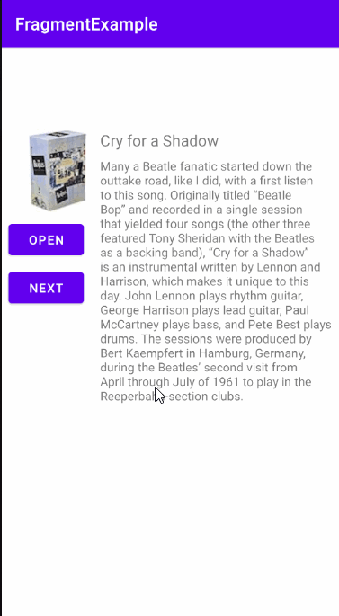

## Fragment added to activity dynamically
 

## Q1 - Which subclass of Fragment displays a vertical list of items that are managed by an adapter?  
Ans:- RowsFragment()
## Q2 - Which of the following is the best sequence for adding a fragment to an activity that is already running?  
Ans:- Declare the location for the fragment inside the activity's layout file using the <FrameLayout> view group. Then get an instance of the fragment and FragmentManager, begin a transaction, use the add() transaction, and commit the transaction.
## Q3 - Which statement gets a reference to a fragment using the fragment's layout resource?  
Ans:- SimpleFragment fragment = (SimpleFragment) fragmentManager.findFragmentById(R.id.fragment_container);